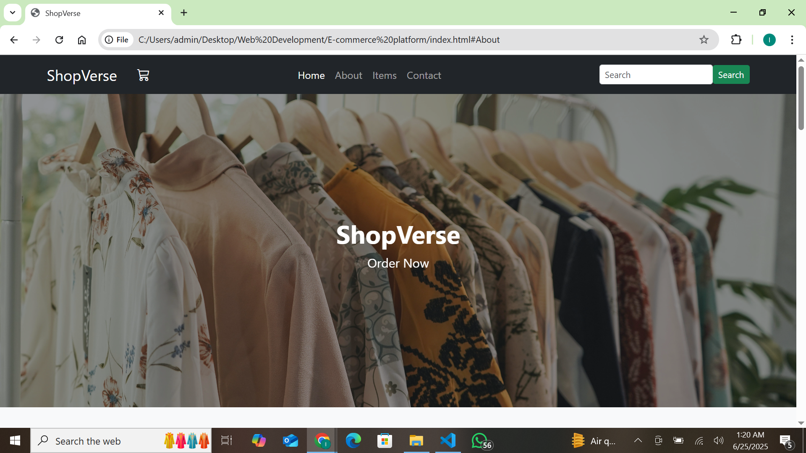

# ShopVerse – Responsive E-Commerce Website

**ShopVerse** is a modern and responsive front-end eCommerce website built using **HTML5**, **CSS3**, and **Bootstrap 5**. It features a clean design, responsive layout, interactive UI elements, and a product showcase grid — making it perfect for demonstrating front-end development skills.

---

## Live Demo
https://ikshamalhotra.github.io/ShopVerse-Responsive-E-Commerce-Website/

---

## Preview



## Technologies Used

* HTML5
* CSS3 (Custom styling)
* Bootstrap 5.3.3
* Bootstrap Icons
* Ionicons
* Vanilla JavaScript
* Unsplash & Pexels (for free product images)

---

## Project Structure

```
shopverse/
│
├── index.html              # Main website file
├── style.css               # Custom styles
├── js/
│   └── script.js           # JS for interactivity
└── README.md               # Project overview
```

---

## Features

* Modern and responsive user interface
* Sticky navbar with offcanvas sidebar
* Auto-playing hero carousel
* Product cards with hover zoom and lift effects
* Add to Cart buttons with feedback
* Structured sections: About, Items, and Footer
* Search filter for products
* Back-to-top button for long page navigation
* Fully mobile-friendly design

---

## JavaScript Functionality

* Sidebar toggle (hamburger menu and close button)
* Dynamic Add to Cart count on cart icon
* Smooth scroll navigation for section links
* Product search filter
* Back to top button based on scroll position

---

## Author

**Iksha Malhotra**

Front-End Web Developer | UI-UX Designer | Cse Student
